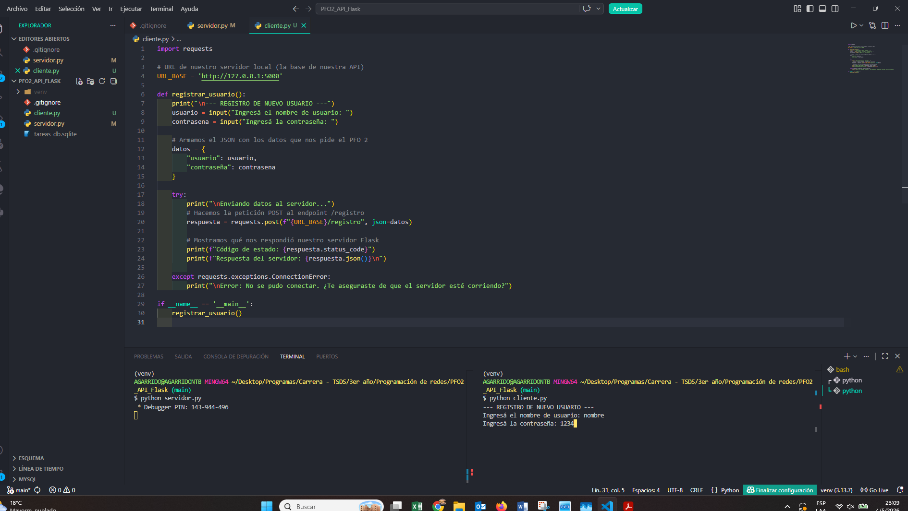
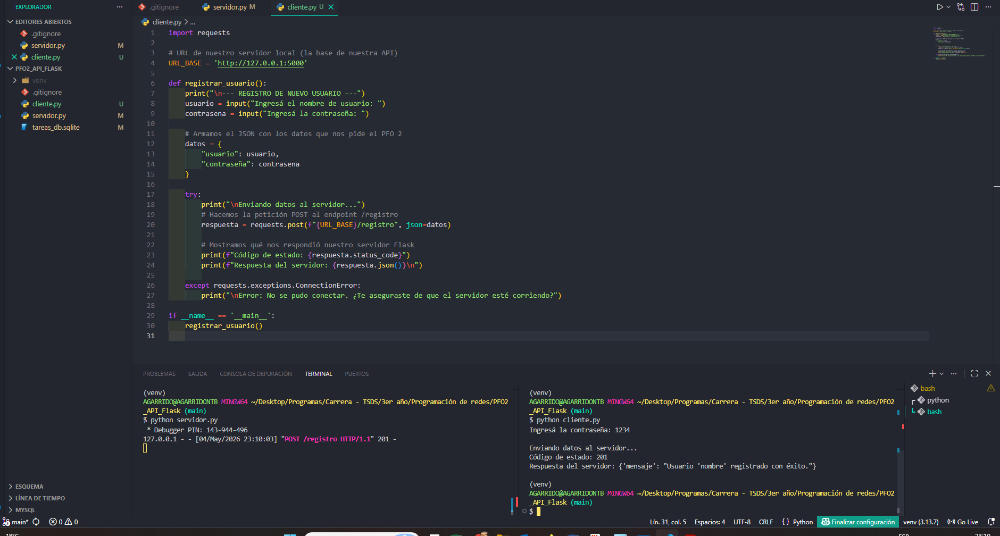
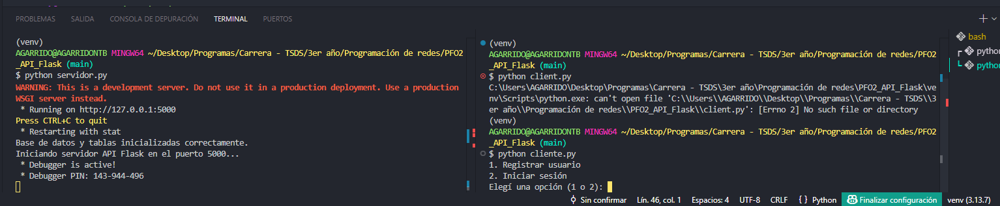
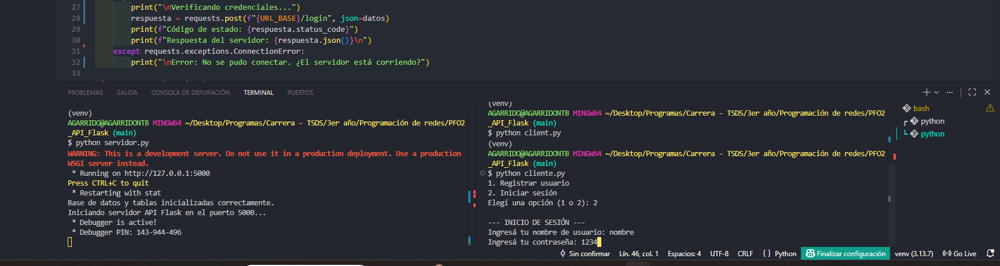
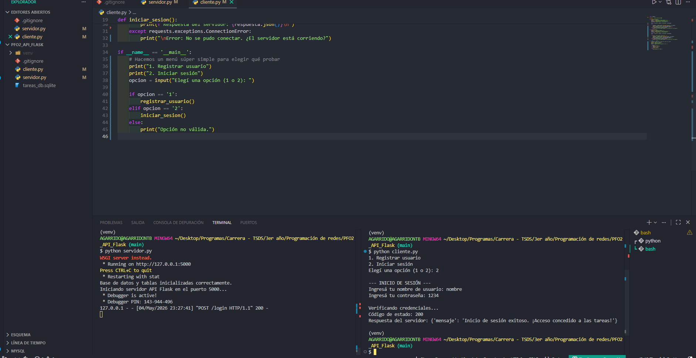
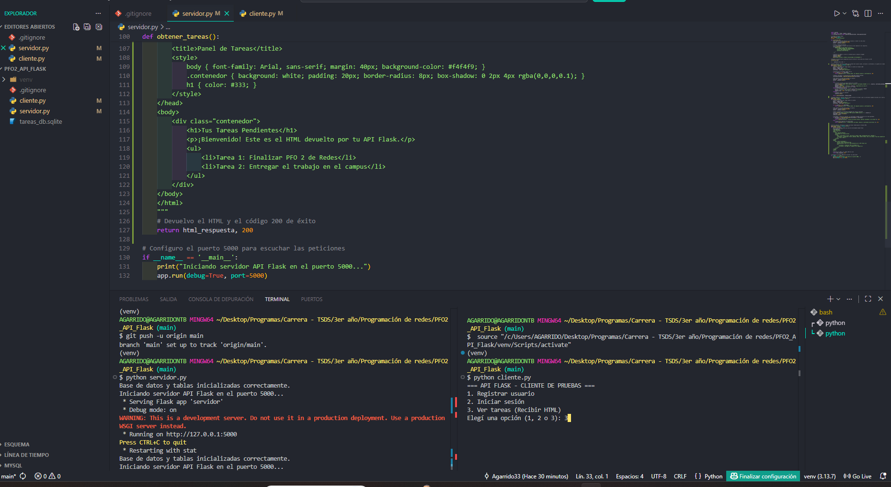
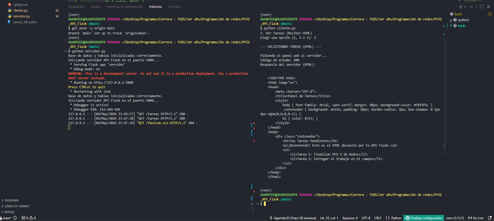
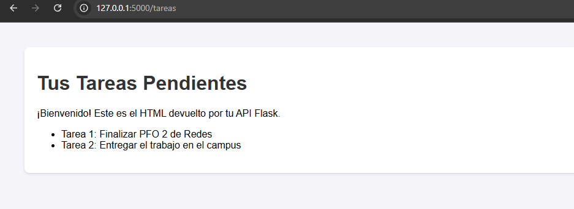

# PFO N° 2: Sistema de Gestión de Tareas con API Flask

En este proyecto desarrollé una API REST funcional utilizando Flask y Python, implementando persistencia de datos y seguridad.

## Características principales que implementé:
1. **Base de datos:** Utilicé SQLite para guardar a los usuarios de forma local y persistente.
2. **Seguridad:** Implementé la librería Werkzeug para encriptar (hashear) las contraseñas antes de guardarlas, evitando que queden en texto plano.
3. **Endpoints:**
   - `POST /registro`: Recibe los datos en formato JSON, hashea la contraseña y crea el usuario.
   - `POST /login`: Verifica que el usuario exista y valida criptográficamente que la contraseña coincida.
   - `GET /tareas`: Devuelve una interfaz web (HTML) con el panel de tareas.
4. **Cliente de pruebas:** Desarrollé un script `cliente.py` con un menú interactivo en consola para comunicarme con la API y probar todas sus funciones.

## Cómo probar mi proyecto:
1. Abrir una terminal y ejecutar el servidor: `python servidor.py`
2. Abrir una segunda terminal y ejecutar el cliente: `python cliente.py`
3. Seguir las instrucciones del menú interactivo en pantalla.

## Capturas de Pruebas Exitosas
A continuación se detallan las pruebas de los endpoints funcionando, demostrando el ciclo completo desde la terminal del cliente hasta el impacto en el servidor:

**1. Registro de Usuario (POST /registro)**
*Cliente enviando la petición con los datos:*

*Servidor guardando en SQLite y devolviendo éxito (201):*

**2. Inicio de Sesión (POST /login)**
*Seleccionando la opción en el menú interactivo:*

*Cliente enviando las credenciales a validar:*

*Servidor validando el hash y concediendo el acceso (200):*

**3. Panel de Tareas Renderizado (GET /tareas)**
*Solicitando el panel web desde el cliente:*

*Respuesta HTML en formato crudo recibida en consola:*

*Renderizado final del panel de tareas en el navegador web local:*

## Respuestas Conceptuales

**1. ¿Por qué es importante utilizar hashing para contraseñas en lugar de guardarlas en texto plano?**
Básicamente, guardar contraseñas en texto plano es un peligro enorme para cualquier sistema. Si el día de mañana alguien nos hackea o se filtra la base de datos, los atacantes tendrían las claves reales de todos los usuarios servidas en bandeja. Al usar hashing (que en este TP lo implementé con la librería Werkzeug), lo que hacemos es transformar esa contraseña en un código cifrado que es irreversible. Así, si alguien logra entrar y robarse el archivo de la base de datos, solo va a ver una mezcla de letras y números sin sentido, manteniendo las cuentas de los usuarios totalmente protegidas.

**2. ¿Qué ventajas ofrece SQLite frente a otros motores de bases de datos para este proyecto?**
La mayor ventaja de SQLite para un TP de esta escala es la practicidad. Al ser una base de datos integrada y sin servidor, me ahorré el dolor de cabeza de tener que instalar, levantar y configurar un motor de base de datos pesado como MySQL o SQL Server en mi máquina. Toda la información del proyecto se guarda directamente en un único archivo local (tareas_db.sqlite) adentro de mi misma carpeta de trabajo. Esto hace que el proyecto sea súper liviano, muy fácil de probar localmente y, sobre todo, fácil de subir y compartir por GitHub sin que el profesor tenga que hacer configuraciones raras para correrlo.